# DSL Compilation System Architecture

This document provides a comprehensive overview of the DSL compilation system, detailing all expression input possibilities, evaluation methods, optimization passes, and code generation paths.

## System Overview

The DSL compilation system provides a two-layer optimization strategy for mathematical expressions:

1. **Symbolic Optimization Layer**: Algebraic simplification, ANF conversion, variable sharing, and egglog optimization
2. **Compilation Backends Layer**: Multiple code generation targets (Rust, Cranelift JIT, direct evaluation)

## Complete Information Flow Diagram

```mermaid
graph TB
    %% Input Layer - Expression input methods
    subgraph "Expression Input Methods"
        CompileTime["`**Compile-Time Expressions**
        • Var&lt;ID&gt;, Const&lt;BITS&gt;
        • Add&lt;L,R&gt;, Mul&lt;L,R&gt;, etc.
        • Type-safe zero-cost abstractions
        • optimize_compile_time! macro`"]
        
        Runtime["`**Runtime Expression Building**
        • ExpressionBuilder/TypedBuilderExpr&lt;T&gt;
        • Wrapper around ASTRepr&lt;T&gt;
        • Variable management + type safety
        • Operator overloading + ergonomics`"]
        
        Direct["`**Direct AST Construction**
        • ASTRepr&lt;T&gt; enum directly
        • Manual tree building
        • Low-level control
        • No variable management`"]
        
        Parser["`**Expression Parsing**
        • String expressions
        • Mathematical notation
        • (Future enhancement)`"]
    end

    %% Variable Management - Only used by Runtime path
    subgraph "Variable Management (Runtime Only)"
        VarRegistry["`**VariableRegistry**
        • Index-based variables
        • Type information
        • Debug names
        • Zero-cost lookups`"]
        
        TypedVars["`**Typed Variables**
        • TypedVar&lt;T&gt; system
        • Compile-time type safety
        • Automatic promotion
        • Cross-type operations`"]
    end

    %% Core Representation - Most paths converge here
    subgraph "Core AST Representation"
        AST["`**ASTRepr&lt;T&gt;**
        • Constant(T)
        • Variable(usize)
        • Binary: Add, Sub, Mul, Div, Pow
        • Unary: Neg, Ln, Exp, Sin, Cos, Sqrt
        • Created by Runtime, Direct, and Compile-Time paths`"]
    end

    %% Automatic Optimization Pipeline
    subgraph "Automatic Optimization Pipeline (SymbolicOptimizer)"
        OptConfig["`**OptimizationConfig**
        • max_iterations: 10
        • egglog_optimization: false
        • constant_folding: true
        • enable_expansion_rules: false`"]
        
        IterativeOpt["`**Iterative Optimization Loop**
        1. Apply arithmetic rules
        2. Apply algebraic rules  
        3. Apply enhanced rules
        4. Constant folding (optional)
        5. Egglog optimization (optional)
        6. Check convergence
        7. Repeat until convergence`"]
        
        SpecializedPipelines["`**Specialized Pipelines**
        • SymbolicAD: 3-stage pipeline
        • SummationProcessor: 4-stage pipeline
        • Both with automatic convergence`"]
    end

    %% Individual Optimization Components
    subgraph "Optimization Components"
        Domain["`**Domain Analysis**
        • Interval domain tracking
        • Mathematical safety checks
        • Constraint propagation
        • Safe operation validation`"]
        
        ANFConversion["`**ANF Conversion**
        • Transform ASTRepr to ANFExpr
        • Let-binding introduction
        • Integrated CSE during conversion
        • VarRef system (User/Bound)
        • Scope-aware optimization`"]
        
        Egglog["`**Egglog Symbolic Optimization**
        • Equality saturation
        • Algebraic identities
        • Domain-aware rules
        • Cost-based extraction
        • Safe iteration limits (3)`"]
        
        Summation["`**Summation Processing**
        • Pattern detection (12+ patterns)
        • Sufficient statistics computation
        • Algebraic expansion
        • Closed-form solutions
        • Statistical pattern recognition
        • Data vs mathematical ranges`"]
    end

    %% ANF System - works with ANFExpr representation
    subgraph "ANF System (works with ANFExpr)"
        ANFEval["`**ANF Evaluation**
        • Interpret ANFExpr directly
        • Let-binding evaluation
        • Variable scope handling
        • Domain-aware evaluation
        • Intermediate results`"]
        
        ANFCodeGen["`**ANF Code Generation**
        • Generate Rust code from ANFExpr
        • Let-binding structure
        • Scoped variables
        • Debug-friendly output`"]
    end

    %% Code Generation
    subgraph "Code Generation Backends"
        RustCodeGen["`**Rust Code Generation**
        • Function generation
        • Inline expressions
        • Value substitution
        • Hot-loading compilation`"]
        
        CraneliftJIT["`**Cranelift JIT**
        • Native machine code
        • Runtime compilation
        • ANF-based IR generation
        • Fast execution`"]
        
        DirectCode["`**Direct Code Generation**
        • Optimized expressions
        • Zero abstraction
        • Compile-time optimization
        • Inline substitution`"]
    end

    %% Evaluation Methods
    subgraph "Evaluation Methods"
        CompiledEval["`**Compiled Evaluation**
        • Native function calls
        • Maximum performance
        • Type-optimized
        • Production use`"]
        
        JITEval["`**JIT Evaluation**
        • Runtime compilation
        • Adaptive optimization
        • Hot-path detection
        • Dynamic performance`"]
        
        DirectEvalMethod["`**Direct AST Evaluation**
        • Tree traversal evaluation
        • No compilation step
        • Immediate results`"]
    end

    %% Output Types
    subgraph "Final Output"
        NativeFunc["`**Native Function**
        • Callable function pointer
        • Maximum performance
        • Platform optimized`"]
        
        RustFunc["`**Rust Function**
        • Dynamic library
        • Hot-reloadable
        • Rustc optimizations`"]
        
        InterpretedResult["`**Interpreted Result**
        • Direct computation
        • No compilation step
        • Immediate feedback`"]
        
        SourceCode["`**Generated Source**
        • Human-readable code
        • Debugging support
        • Integration ready`"]
    end

    %% Flow connections
    %% Runtime uses variable management services (supporting relationship)
    VarRegistry -.-> Runtime
    TypedVars -.-> Runtime
    
    %% Expression input methods converge on AST
    Runtime --> Direct
    Direct --> AST
    CompileTime --> AST
    Parser --> AST
    
    %% AST feeds into automatic optimization pipeline
    AST --> OptConfig
    OptConfig --> IterativeOpt
    IterativeOpt --> SpecializedPipelines
    
    %% Automatic pipeline uses individual components
    IterativeOpt -.-> Domain
    IterativeOpt -.-> Egglog
    IterativeOpt -.-> Summation
    SpecializedPipelines -.-> ANFConversion
    
    %% Manual access to individual components
    AST -.-> Domain
    AST -.-> ANFConversion
    AST -.-> Egglog
    AST -.-> Summation
    
    %% ANF conversion creates ANFExpr for evaluation and code generation
    ANFConversion --> ANFEval
    ANFConversion --> ANFCodeGen
    ANFConversion --> CraneliftJIT
    
    %% Code generation paths from optimized AST
    IterativeOpt --> RustCodeGen
    IterativeOpt --> CraneliftJIT
    CompileTime --> DirectCode
    Egglog --> RustCodeGen
    
    %% Evaluation paths
    RustCodeGen --> CompiledEval
    CraneliftJIT --> JITEval
    AST --> DirectEvalMethod
    
    %% Final outputs
    ANFEval --> InterpretedResult
    CompiledEval --> NativeFunc
    JITEval --> NativeFunc
    RustCodeGen --> RustFunc
    ANFCodeGen --> SourceCode
    DirectCode --> SourceCode
    DirectEvalMethod --> InterpretedResult
    
    %% Styling
    classDef inputClass fill:#e1f5fe
    classDef varClass fill:#e8f5e8
    classDef astClass fill:#fff3e0
    classDef pipelineClass fill:#e8eaf6
    classDef optClass fill:#f3e5f5
    classDef anfClass fill:#e3f2fd
    classDef codegenClass fill:#e8f5e8
    classDef evalClass fill:#fff3e0
    classDef outputClass fill:#fce4ec
    
    class CompileTime,Runtime,Direct,Parser inputClass
    class VarRegistry,TypedVars varClass
    class AST astClass
    class OptConfig,IterativeOpt,SpecializedPipelines pipelineClass
    class Domain,ANFConversion,Egglog,Summation optClass
    class ANFEval,ANFCodeGen anfClass
    class RustCodeGen,CraneliftJIT,DirectCode codegenClass
    class CompiledEval,JITEval,DirectEvalMethod evalClass
    class NativeFunc,RustFunc,InterpretedResult,SourceCode outputClass
```



## Expression Input Possibilities

### 1. Compile-Time Expressions
- **Type-safe zero-cost abstractions** using Rust's type system
- **Compile-time variables**: `Var<const ID: usize>`
- **Compile-time constants**: `Const<const BITS: u64>`
- **Expression types**: `Add<L,R>`, `Mul<L,R>`, `Sin<T>`, etc.
- **Macro optimization**: `optimize_compile_time!` for egglog-based optimization
- **Benefits**: Zero runtime overhead, compile-time optimization, type safety
- **Direct path**: Can generate optimized code directly without going through full pipeline

### 2. Runtime Expression Building (Uses Variable Management)
- **ExpressionBuilder/TypedBuilderExpr<T>**: High-level interface for dynamic expression construction
- **Wrapper around ASTRepr<T>**: `TypedBuilderExpr<T>` contains an `ASTRepr<T>` internally
- **Variable management**: `VariableRegistry` and `TypedVar<T>` system for type-safe variables
- **Type safety**: Compile-time type checking with automatic promotion (f32 → f64)
- **Operator overloading**: Natural mathematical syntax (`x + y`, `sin(x)`, etc.)
- **Ergonomic features**: Built-in mathematical functions, summation processing, optimization
- **Conversion**: `TypedBuilderExpr<T>` can be converted to `ASTRepr<T>` via `into_ast()`
- **Key insight**: This is essentially Direct AST Construction with a user-friendly wrapper

### 3. Direct AST Construction
- **ASTRepr<T> enum**: Direct manipulation of expression trees without wrappers
- **Manual tree building**: For specialized use cases, parsing, or when you need low-level control
- **No variable management**: Works directly with variable indices (no registry)
- **Low-level access**: Direct access to all AST node types and structure
- **Performance**: Minimal overhead since there's no wrapper layer

### 4. Expression Parsing
- **String expressions**: Mathematical notation parsing (future enhancement)
- **Domain-specific syntax**: Custom mathematical dialects
- **Import capabilities**: From external mathematical systems

## Core AST Representation

All expression input methods converge on `ASTRepr<T>`, which is the central representation:

```rust
enum ASTRepr<T> {
    Constant(T),
    Variable(usize),  // Index-based variables
    Add(Box<ASTRepr<T>>, Box<ASTRepr<T>>),
    Sub(Box<ASTRepr<T>>, Box<ASTRepr<T>>),
    Mul(Box<ASTRepr<T>>, Box<ASTRepr<T>>),
    Div(Box<ASTRepr<T>>, Box<ASTRepr<T>>),
    Pow(Box<ASTRepr<T>>, Box<ASTRepr<T>>),
    Neg(Box<ASTRepr<T>>),
    Ln(Box<ASTRepr<T>>),
    Exp(Box<ASTRepr<T>>),
    Sin(Box<ASTRepr<T>>),
    Cos(Box<ASTRepr<T>>),
    Sqrt(Box<ASTRepr<T>>),
}
```

## Optimization Pipeline

The system provides **both automatic and manual optimization pipelines** with the automatic pipeline being the primary interface:

### **Automatic Pipeline** (SymbolicOptimizer) - **PRIMARY INTERFACE**

The `SymbolicOptimizer` provides a **fully automatic iterative pipeline** that runs until convergence:

```rust
pub fn optimize(&mut self, expr: &ASTRepr<f64>) -> Result<ASTRepr<f64>> {
    let mut optimized = expr.clone();
    let mut iterations = 0;

    // Apply optimization passes until convergence or max iterations
    while iterations < self.config.max_iterations {
        let before = optimized.clone();

        // Layer 1: Apply basic algebraic simplifications (hand-coded rules)
        optimized = Self::apply_arithmetic_rules(&optimized)?;
        optimized = Self::apply_algebraic_rules(&optimized)?;
        optimized = self.apply_enhanced_algebraic_rules(&mut optimized)?;

        if self.config.constant_folding {
            optimized = Self::apply_constant_folding(&optimized)?;
        }

        // Layer 2: Apply egglog symbolic optimization (if enabled)
        if self.config.egglog_optimization {
            optimized = optimize_with_native_egglog(&optimized)?;
        }

        // Check for convergence
        if expressions_equal_default(&before, &optimized) {
            break;
        }

        iterations += 1;
    }

    Ok(optimized)
}
```

**Configuration**: `OptimizationConfig` controls which passes run:
- `max_iterations: 10` - Maximum optimization iterations (default)
- `constant_folding: true` - Enable constant folding (default: enabled)
- `egglog_optimization: false` - Enable egglog symbolic optimization (default: **disabled** for performance)
- `enable_expansion_rules: false` - Enable expansion rules (default: disabled)
- `enable_distribution_rules: false` - Enable distribution rules (default: disabled)

### **Specialized Automatic Pipelines**

#### **SymbolicAD Pipeline** (3-Stage Automatic)
```rust
// Stage 1: Pre-optimization using egglog
let pre_optimized = if self.config.pre_optimize {
    self.optimizer.optimize(expr)?
} else {
    expr.clone()
};

// Stage 2: Symbolic differentiation
let derivatives = compute_derivatives(&pre_optimized)?;

// Stage 3: Post-optimization with subexpression sharing
let (optimized_function, optimized_derivatives, shared_subexpressions) = 
    if self.config.post_optimize && self.config.share_subexpressions {
        self.optimize_with_subexpression_sharing(&pre_optimized, &derivatives)?
    } else {
        // Individual optimization without sharing
    };
```

#### **SummationProcessor Pipeline** (4-Stage Automatic)
```rust
// Step 0: Optimize the expression first (CRITICAL for handling 0*i -> 0)
let optimized_summand = if self.config.enable_pattern_recognition {
    self.optimizer.optimize(&summand)?
} else {
    summand.clone()
};

// Step 1: Extract constant factors
let (extracted_factors, simplified_expr) = if self.config.enable_factor_extraction {
    self.extract_constant_factors(&optimized_summand)?
} else {
    (vec![], optimized_summand.clone())
};

// Step 2: Recognize patterns (12+ pattern types)
let pattern = if self.config.enable_pattern_recognition {
    self.recognize_pattern(&simplified_expr)?
} else {
    SummationPattern::Unknown
};

// Step 3: Compute closed form
let closed_form = if self.config.enable_closed_form {
    self.compute_closed_form(&range, &simplified_expr, &pattern)?
} else {
    None
};
```

### **Manual Pipeline** (Component-by-Component) - **EXPERT INTERFACE**

For fine-grained control, users can orchestrate optimization passes manually:

```rust
// Manual pipeline example
let mut expr = original_ast;

// Step 1: Domain analysis (optional)
let domain_analyzer = IntervalDomainAnalyzer::new();
domain_analyzer.analyze(&expr)?;

// Step 2: ANF conversion with integrated CSE
let mut anf_converter = ANFConverter::new();
let anf_expr = anf_converter.convert(&expr)?;

// Step 3: Symbolic optimization (optional)
if enable_egglog {
    expr = optimize_with_native_egglog(&expr)?;
}

// Step 4: Summation processing (for specific patterns)
if has_summations {
    let summation_processor = SummationProcessor::new()?;
    expr = summation_processor.process_summation(range, summand)?;
}
```

### **Pipeline Characteristics**

#### **Automatic Orchestration** (Most Users)
- **SymbolicOptimizer**: Fully automatic iterative pipeline with convergence detection
- **SymbolicAD**: 3-stage automatic pipeline for differentiation with subexpression sharing
- **SummationProcessor**: 4-stage automatic pipeline for summations with pattern recognition
- **Convergence detection**: Stops when no further improvements found
- **Configurable**: Enable/disable individual passes via `OptimizationConfig`

#### **Manual Orchestration** (Expert Users)
- **Component access**: Direct access to individual optimization passes
- **Custom pipelines**: Build application-specific optimization sequences
- **Performance control**: Skip expensive passes when not needed
- **Debugging**: Step through optimization passes individually

#### **Performance Considerations**
- **Default conservative**: Most expensive optimizations disabled by default for performance
- **Test environment**: Automatically reduces iterations and disables egglog in tests
- **Production tuning**: Full optimization available when explicitly enabled
- **Adaptive**: Can upgrade optimization strategy based on expression complexity

### **Key Insights**

1. **Automatic by Default**: Most users get automatic optimization without manual intervention  
2. **True Iterative Pipeline**: The optimization system runs multiple passes until convergence
3. **Configurable**: All passes can be enabled/disabled via configuration
4. **Specialized Pipelines**: Domain-specific automatic pipelines for AD and summation processing
5. **Manual Override**: Expert users can orchestrate passes manually for fine control
6. **Performance First**: Conservative defaults prioritize compilation speed over optimization depth

## Optimization Components

The pipeline uses several key optimization components:

### Domain Analysis
- **Interval domain tracking**: Monitor value ranges throughout optimization
- **Mathematical safety**: Prevent invalid operations (e.g., `ln(-1)`, `sqrt(-1)`)
- **Constraint propagation**: Propagate domain constraints through expressions
- **Safe operation validation**: Verify operations are mathematically valid
- **Integration**: Can feed into ANF conversion for domain-aware optimization

### ANF (Administrative Normal Form) System

The ANF system consists of **three distinct components** that work with the same `ANFExpr<T>` representation:

#### 1. **ANF Conversion** (AST → ANF)
- **Input**: `ASTRepr<T>` expressions
- **Output**: `ANFExpr<T>` expressions  
- **Purpose**: Transform complex nested expressions into let-binding form
- **Features**:
  - **Let-binding introduction**: Convert complex expressions to intermediate variables
  - **Integrated CSE**: Common subexpression elimination built into conversion process
  - **Structural hashing**: Identify identical expression patterns during conversion
  - **Scope tracking**: Maintain variable scope throughout optimization (binding depth)
  - **VarRef system**: Distinguish between user variables (`User(usize)`) and generated intermediates (`Bound(u32)`)
  - **Cache management**: Efficient CSE cache with scope validation
  - **Integer power optimization**: Binary exponentiation for integer exponents
- **Implementation**: `ANFConverter` struct with `convert()` method

#### 2. **ANF Evaluation** (ANF → Values)
- **Input**: `ANFExpr<T>` expressions
- **Output**: Computed numeric values
- **Purpose**: Interpret ANF expressions directly without compilation
- **Features**:
  - **Let-binding evaluation**: Process intermediate variables in order
  - **Variable scope handling**: Proper scoping for user vs. generated variables  
  - **Domain-aware evaluation**: Mathematical safety during evaluation
  - **Intermediate results**: Access to computation intermediate values
  - **Bound variable management**: Efficient handling of generated variables
  - **Two evaluation modes**: Standard (`eval()`) and domain-aware (`eval_domain_aware()`)
- **Implementation**: Methods on `ANFExpr<T>` like `eval()` and `eval_with_bound_vars()`

#### 3. **ANF Code Generation** (ANF → Source Code)
- **Input**: `ANFExpr<T>` expressions
- **Output**: Generated Rust source code
- **Purpose**: Generate readable, efficient code from ANF representation
- **Features**:
  - **Let-binding structure**: Generate code reflecting ANF structure
  - **Scoped variables**: Proper variable scoping in generated code
  - **Efficient evaluation**: Optimized for sequential computation
  - **Debug-friendly**: Clear, readable generated code with proper variable names
  - **Function generation**: Complete Rust functions with proper signatures
  - **Rust output**: Generates valid Rust code from ANF representation
- **Implementation**: `ANFCodeGen` struct with `generate()` and `generate_function()` methods

#### ANF Data Flow

```
ASTRepr<T> 
    ↓ (ANF Conversion)
ANFExpr<T>
    ↓ (branches to three uses)
    ├── ANF Evaluation → Numeric Values
    ├── ANF Code Generation → Rust Source Code  
    └── Cranelift JIT → Machine Code (via IR generation)
```

#### Key Insight: Shared Representation

All three components work with the **same `ANFExpr<T>` representation**:

```rust
enum ANFExpr<T> {
    Atom(ANFAtom<T>),                           // Constants and variables
    Let(VarRef, ANFComputation<T>, Box<ANFExpr<T>>), // Let-bindings
}
```

But they serve **completely different purposes**:
- **Conversion**: Creates the ANF representation (transformation)
- **Evaluation**: Executes the ANF representation (interpretation)  
- **Code Generation**: Translates the ANF representation (compilation)

### Egglog Symbolic Optimization
- **Equality saturation**: Explore all equivalent expression forms
- **Algebraic identities**: Apply mathematical transformation rules
- **Domain-aware rules**: Respect mathematical domain constraints
- **Cost-based extraction**: Choose the best equivalent expression form
- **Native integration**: Uses native egglog implementation for performance
- **Iteration limits**: Configurable bounds to prevent infinite expansion

### Summation Processing
- **Pattern detection**: Identify summation patterns (linear, quadratic, power, etc.)
- **Sufficient statistics**: Compute statistical summaries for datasets
- **Algebraic expansion**: Expand complex summation expressions like `(y - β₀ - β₁*x)²`
- **Closed-form solutions**: Convert summations to direct mathematical expressions
- **Integration**: Works with both closure-based and pair-based summations
- **Scope isolation**: Uses independent `ExpressionBuilder` for summation variables

## Code Generation Backends

### Rust Code Generation
- **Input**: Can work with `ASTRepr` or optimized expressions from egglog
- **Function generation**: Complete Rust functions with proper signatures
- **Inline expressions**: Direct Rust expressions for embedding
- **Value substitution**: Replace variables with actual values
- **Hot-loading compilation**: Dynamic library generation and loading
- **Optimization levels**: Configure rustc optimization settings (O0, O1, O2, O3)

### Cranelift JIT
- **Input**: Primarily works with ANF representation for cleaner IR generation
- **Native machine code**: Direct compilation to target architecture
- **ANF-based compilation**: Uses ANF as input for efficient variable handling
- **Modern backend**: Uses latest Cranelift APIs and patterns
- **Math function integration**: Direct libcall integration for transcendental functions
- **Variable mapping**: Efficient handling of user (`VarRef::User`) and bound (`VarRef::Bound`) variables

### ANF Code Generation
- **Input**: ANF expressions only
- **Let-binding structure**: Generate code reflecting ANF structure
- **Scoped variables**: Proper variable scoping in generated code
- **Efficient evaluation**: Optimized for sequential computation
- **Debug-friendly**: Clear, readable generated code with proper variable names
- **Rust output**: Generates valid Rust code from ANF representation

### Direct Code Generation
- **Input**: Compile-time expressions only
- **Optimized expressions**: Generate optimal code from compile-time optimization
- **Zero abstraction**: No runtime overhead in generated code
- **Compile-time optimization**: Leverage egglog optimization results
- **Inline substitution**: Direct value substitution where possible
- **Macro-driven**: Used by `optimize_compile_time!`