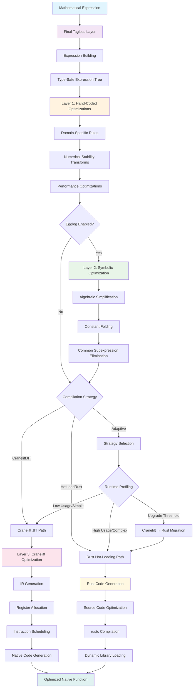

# MathJIT: High-Performance Symbolic Mathematics

MathJIT is a high-performance symbolic mathematics library built around the **final tagless** approach, providing zero-cost abstractions for mathematical expressions with multiple evaluation strategies.

## 🚀 Key Features

- **Final Tagless Architecture**: Zero-cost abstractions using Generic Associated Types (GATs)
- **Multiple Interpreters**: Same expression definition, multiple evaluation strategies
- **Type Safety**: Compile-time guarantees without runtime overhead
- **Extensible Design**: Easy to add new operations and interpreters
- **High Performance**: Direct evaluation with native Rust operations

## 🎯 Design Goals

1. **Entirely Final Tagless**: Clean separation between expression definition and interpretation
2. **Egglog Optimization**: Symbolic optimization capabilities (coming soon)
3. **Cranelift JIT**: Native code compilation for maximum performance (coming soon)
4. **General Purpose**: Fast and flexible for evaluating mathematical expressions

## 🏗️ Architecture & Compilation Pipeline

MathJIT employs a sophisticated three-layer optimization strategy with multiple compilation backends:



### Compilation Passes Detail

#### **Layer 1: Hand-Coded Domain Optimizations**
- **Location**: JIT expression building phase
- **Purpose**: Apply mathematical domain knowledge for optimal transformations
- **Examples**:
  - `x^2` → `x * x` (multiplication faster than general power)
  - `ln(x)` → `ln(1 + (x-1))` for numerical stability near 1
  - Trigonometric identities and range reductions

#### **Layer 2: Symbolic Optimization (Egglog) - Optional**
- **Location**: Expression preprocessing before compilation (when enabled)
- **Purpose**: Algebraic simplification and structural optimization
- **Control**: Enabled via `OptimizationConfig::egglog_optimization` (default: `false`)
- **Optimizations**:
  - Algebraic identities: `x + 0 = x`, `x * 1 = x`, `x * 0 = 0`
  - Associativity/commutativity: `(a + b) + c = a + (b + c)`
  - Distributive law: `a * (b + c) = a*b + a*c`
  - Constant folding: `2 + 3 = 5`
  - Common subexpression elimination

#### **Layer 3: Backend-Specific Optimization**

##### **Cranelift JIT Backend**
- **Best for**: Simple expressions, rapid iteration, low latency
- **Optimizations**:
  - Register allocation and instruction scheduling
  - Dead code elimination at IR level
  - Basic block optimizations
  - Target-specific instruction selection

##### **Rust Hot-Loading Backend**
- **Best for**: Complex expressions, maximum performance, production use
- **Process**:
  1. Generate optimized Rust source code
  2. Compile with rustc at specified optimization level (O0-O3)
  3. Load as dynamic library
  4. Cache for subsequent use

##### **Adaptive Strategy**
- **Intelligence**: Runtime profiling and automatic backend selection
- **Metrics**: Call frequency, expression complexity, execution time
- **Behavior**: Start with Cranelift, upgrade to Rust for hot expressions

## 📦 Installation

Add this to your `Cargo.toml`:

```toml
[dependencies]
mathjit = "0.1.0"
```

## 🔧 Quick Start

### Traditional Final Tagless Approach

```rust
use mathjit::final_tagless::{MathExpr, DirectEval, PrettyPrint};

// Define a polymorphic mathematical expression
fn quadratic<E: MathExpr>(x: E::Repr<f64>) -> E::Repr<f64>
where
    E::Repr<f64>: Clone,
{
    let a = E::constant(2.0);
    let b = E::constant(3.0);
    let c = E::constant(1.0);
    
    E::add(
        E::add(
            E::mul(a, E::pow(x.clone(), E::constant(2.0))),
            E::mul(b, x)
        ),
        c
    )
}

fn main() {
    // Direct evaluation
    let result = quadratic::<DirectEval>(DirectEval::var("x", 2.0));
    println!("quadratic(2) = {}", result); // 15.0
    
    // Pretty printing
    let pretty = quadratic::<PrettyPrint>(PrettyPrint::var("x"));
    println!("Expression: {}", pretty); // (((2 * (x ^ 2)) + (3 * x)) + 1)
}
```

### Modern Operator Overloading (New! 🎉)

```rust
use mathjit::prelude::*;

// Define the same expression with natural mathematical syntax
fn quadratic_modern(x: Expr<DirectEval, f64>) -> Expr<DirectEval, f64> {
    let a = Expr::constant(2.0);
    let b = Expr::constant(3.0);
    let c = Expr::constant(1.0);
    
    // Natural mathematical syntax!
    a * x.clone().pow(Expr::constant(2.0)) + b * x + c
}

fn main() {
    // Direct evaluation with ergonomic syntax
    let result = quadratic_modern(Expr::var_with_value("x", 2.0));
    println!("quadratic(2) = {}", result.eval()); // 15.0
    
    // Pretty printing with operator overloading
    fn quadratic_pretty(x: Expr<PrettyPrint, f64>) -> Expr<PrettyPrint, f64> {
        let a = Expr::constant(2.0);
        let b = Expr::constant(3.0);
        let c = Expr::constant(1.0);
        a * x.clone().pow(Expr::constant(2.0)) + b * x + c
    }
    
    let pretty = quadratic_pretty(Expr::<PrettyPrint, f64>::var("x"));
    println!("Expression: {}", pretty.to_string()); // (((2 * (x ^ 2)) + (3 * x)) + 1)
    
    // Complex expressions are much more readable!
    fn gaussian(x: Expr<DirectEval, f64>) -> Expr<DirectEval, f64> {
        let two = Expr::constant(2.0);
        let pi = Expr::constant(std::f64::consts::PI);
        
        let x_squared = x.clone() * x;
        let neg_x_squared_over_two = -(x_squared / two.clone());
        let numerator = neg_x_squared_over_two.exp();
        let denominator = (two * pi).sqrt();
        
        numerator / denominator
    }
    
    let gaussian_result = gaussian(Expr::var_with_value("x", 0.0));
    println!("gaussian(0) = {:.6}", gaussian_result.eval()); // 0.398942
}
```

## 🏗️ Core Architecture

### Core Traits

- **`MathExpr`**: Defines basic mathematical operations (arithmetic, transcendental functions)
- **`StatisticalExpr`**: Extends `MathExpr` with statistical functions (logistic, softplus)
- **`NumericType`**: Helper trait bundling common numeric type requirements

### Interpreters

- **`DirectEval`**: Immediate evaluation using native Rust operations (`type Repr<T> = T`)
- **`PrettyPrint`**: String representation generation (`type Repr<T> = String`)
- **`JITEval`**: Expression representation for JIT compilation (`type Repr<T> = JITRepr<T>`)

### Compilation Strategies

```rust
use mathjit::symbolic::{CompilationStrategy, RustOptLevel};
use std::path::PathBuf;

// Fast JIT compilation (default)
let strategy = CompilationStrategy::CraneliftJIT;

// High-performance Rust compilation
let strategy = CompilationStrategy::HotLoadRust {
    source_dir: PathBuf::from("./generated"),
    lib_dir: PathBuf::from("./libs"),
    opt_level: RustOptLevel::O3,
};

// Adaptive strategy with automatic optimization
let strategy = CompilationStrategy::Adaptive {
    call_threshold: 100,      // Upgrade after 100 calls
    complexity_threshold: 50, // Upgrade if expression has >50 operations
};
```

## 🔬 Advanced Usage

### Polynomial Evaluation with Horner's Method

MathJIT provides efficient polynomial evaluation using Horner's method, which reduces the number of multiplications from O(n²) to O(n) and provides better numerical stability:

```rust
use mathjit::final_tagless::{DirectEval, PrettyPrint, polynomial};

// Evaluate 5 + 4x + 3x² + 2x³ using Horner's method
let coeffs = [5.0, 4.0, 3.0, 2.0]; // [constant, x, x², x³]
let result = polynomial::horner::<DirectEval, f64>(&coeffs, DirectEval::var("x", 2.0));
println!("Polynomial at x=2: {}", result); // 41

// Pretty print the Horner structure
let pretty = polynomial::horner::<PrettyPrint, f64>(&coeffs, PrettyPrint::var("x"));
println!("Horner form: {}", pretty); // ((((((2 * x) + 3) * x) + 4) * x) + 5)

// Create polynomial from roots: (x-1)(x-2)(x-3)
let roots = [1.0, 2.0, 3.0];
let poly = polynomial::from_roots::<DirectEval, f64>(&roots, DirectEval::var("x", 0.0));
println!("Polynomial at x=0: {}", poly); // -6

// Evaluate polynomial derivative
let derivative = polynomial::horner_derivative::<DirectEval, f64>(&coeffs, DirectEval::var("x", 2.0));
println!("Derivative at x=2: {}", derivative); // 40
```

### Statistical Functions

```rust
use mathjit::final_tagless::{StatisticalExpr, DirectEval};

fn logistic_regression<E: StatisticalExpr>(x: E::Repr<f64>, theta: E::Repr<f64>) -> E::Repr<f64> {
    E::logistic(E::mul(theta, x))
}

let result = logistic_regression::<DirectEval>(
    DirectEval::var("x", 2.0),
    DirectEval::var("theta", 1.5)
);
println!("logistic_regression(2, 1.5) = {}", result);
```

### Complete Optimization Pipeline Example

```rust
use mathjit::prelude::*;
use mathjit::symbolic::{CompilationStrategy, OptimizationConfig, RustOptLevel};

fn optimization_pipeline_demo() -> Result<()> {
    // 1. Build expression using final tagless approach
    let expr = <JITEval as JITMathExpr>::add(
        <JITEval as JITMathExpr>::mul(
            <JITEval as JITMathExpr>::add(
                <JITEval as JITMathExpr>::var("x"),
                <JITEval as JITMathExpr>::constant(0.0), // Will be optimized away
            ),
            <JITEval as JITMathExpr>::constant(2.0),
        ),
        <JITEval as JITMathExpr>::ln(
            <JITEval as JITMathExpr>::exp(<JITEval as JITMathExpr>::var("y")) // ln(exp(y)) = y
        ),
    );
    
    // 2. Configure symbolic optimization
    let mut config = OptimizationConfig::default();
    config.egglog_optimization = true;
    config.constant_folding = true;
    config.aggressive = true;
    
    // 3. Set up adaptive compilation strategy
    let strategy = CompilationStrategy::Adaptive {
        call_threshold: 10,
        complexity_threshold: 20,
    };
    
    let mut optimizer = SymbolicOptimizer::with_config(config)?;
    optimizer.set_compilation_strategy(strategy);
    
    // 4. Apply symbolic optimizations
    let optimized = optimizer.optimize(&expr)?;
    println!("Optimized: x*2 + y"); // Simplified from complex expression
    
    // 5. Compile with appropriate backend
    let approach = optimizer.choose_compilation_approach(&optimized, "demo_expr");
    match approach {
        CompilationApproach::Cranelift => {
            let compiler = JITCompiler::new()?;
            let jit_func = compiler.compile_two_vars(&optimized, "x", "y")?;
            let result = jit_func.call_two_vars(3.0, 1.0);
            println!("JIT result: {}", result); // 7.0
        }
        CompilationApproach::RustHotLoad => {
            let rust_code = optimizer.generate_rust_source(&optimized, "hot_func")?;
            // Compile and load dynamic library...
        }
        _ => {}
    }
    
    Ok(())
}
```

### Extension Example

Adding new operations is straightforward with trait extension:

```rust
use mathjit::final_tagless::*;
use num_traits::Float;

// Extend with hyperbolic functions
trait HyperbolicExpr: MathExpr {
    fn tanh<T: NumericType + Float>(x: Self::Repr<T>) -> Self::Repr<T>
    where
        Self::Repr<T>: Clone,
    {
        let exp_x = Self::exp(x.clone());
        let exp_neg_x = Self::exp(Self::neg(x));
        let numerator = Self::sub(exp_x.clone(), exp_neg_x.clone());
        let denominator = Self::add(exp_x, exp_neg_x);
        Self::div(numerator, denominator)
    }
}

// Automatically works with all existing interpreters
impl HyperbolicExpr for DirectEval {}
impl HyperbolicExpr for PrettyPrint {}
```

## 🚧 Roadmap

### Current Status
- [x] **Final Tagless Architecture**: Complete with multiple interpreters
- [x] **Cranelift JIT Compilation**: Fast native code generation
- [x] **Rust Hot-Loading**: High-performance dynamic library compilation
- [x] **Symbolic Optimization**: Hand-coded algebraic simplifications
- [x] **Adaptive Compilation**: Runtime strategy selection
- [ ] **Egglog Integration**: Full symbolic optimization (in progress)

### Upcoming Features
- [ ] **Enhanced Egglog Optimization**: Complete symbolic rewrite system
- [ ] **Automatic Differentiation**: Support for dual numbers and gradients
- [ ] **SIMD Support**: Vectorized operations for batch evaluation
- [ ] **GPU Acceleration**: CUDA/OpenCL backends for parallel computation
- [ ] **Expression Caching**: Persistent compilation cache
- [ ] **Parallel Evaluation**: Multi-threaded expression evaluation

## 🔍 Technical Details

### Final Tagless Approach

The final tagless approach solves the expression problem by:

1. **Parameterizing representation types**: Operations are defined over abstract representation types `Repr<T>`
2. **Trait-based extensibility**: New operations can be added via trait extension
3. **Zero intermediate representation**: Expressions compile directly to target representations

### Performance Characteristics

#### **Compilation Time vs Execution Speed Tradeoffs**

| Strategy | Compilation Time | Execution Speed | Best Use Case |
|----------|------------------|-----------------|---------------|
| DirectEval | Instant | Good | Development, simple expressions |
| Cranelift JIT | ~1-10ms | Excellent | Interactive use, moderate complexity |
| Rust Hot-Loading | ~100-1000ms | Outstanding | Production, complex expressions |
| Adaptive | Variable | Optimal | General purpose, unknown workloads |

#### **Optimization Impact**

- **Symbolic optimization**: 2-10x reduction in expression complexity
- **Constant folding**: Eliminates runtime computation for known values
- **Algebraic simplification**: Reduces operation count by 20-80%
- **Backend selection**: 10-100x performance improvement for appropriate expressions

#### **Benchmarking**

```bash
# Run comprehensive benchmarks
cargo bench

# Compare optimization strategies
cargo bench optimization_comparison

# Test compilation strategies
cargo bench compilation_strategies

# Measure optimization overhead
cargo bench optimization_tradeoff
```

### Architecture Benefits

- **Zero-cost abstractions**: No runtime overhead for polymorphic expressions
- **Compile-time optimization**: Rust's optimizer can inline and optimize across interpreter boundaries
- **Type-driven dispatch**: No dynamic dispatch or boxing required
- **Adaptive intelligence**: Automatic performance optimization based on usage patterns

## 📚 Examples

See the `examples/` directory for comprehensive examples:

- `basic_usage.rs`: Introduction to the final tagless approach
- `polynomial_demo.rs`: Polynomial evaluation using Horner's method
- `symbolic_optimization_demo.rs`: Complete optimization pipeline demonstration
- `jit_compilation_demo.rs`: Cranelift JIT compilation examples
- `rust_hotloading_demo.rs`: Rust hot-loading compilation examples
- `adaptive_strategy_demo.rs`: Adaptive compilation strategy in action

### Running Examples

```bash
# Basic final tagless usage
cargo run --example basic_usage

# Symbolic optimization pipeline
cargo run --example symbolic_optimization_demo --features optimization

# JIT compilation with Cranelift
cargo run --example jit_compilation_demo --features jit

# Benchmark different strategies
cargo bench
```

## 🤝 Contributing

Contributions are welcome! Please feel free to submit a Pull Request.

## 📄 License

This project is licensed under the MIT OR Apache-2.0 license.

## 🔗 Related Projects

- [symbolic-math](../symbolic-math): The original symbolic mathematics crate that inspired MathJIT
- [measures](../): The parent project for measure theory and probability distributions 