# MathCompile System Architecture

This diagram shows the relationships between the key traits and structs in the MathCompile system.

```mermaid
graph LR
    %% Core Trait Hierarchy
    subgraph "Core Trait System"
        NumericType["`**NumericType**
        Helper trait bundling common bounds
        Clone + Default + Send + Sync + Display + Debug`"]
        
        FloatType["`**FloatType**
        Floating-point operations
        + num_traits::Float + Copy`"]
        
        IntType["`**IntType**
        Signed integer operations
        + Copy`"]
        
        UIntType["`**UIntType**
        Unsigned integer operations
        + Copy`"]
        
        PromoteTo["`**PromoteTo&lt;T&gt;**
        Automatic type promotion`"]
    end
    
    %% Expression Trait Hierarchy
    subgraph "Expression Trait System"
        MathExpr["`**MathExpr**
        Core mathematical expressions
        GAT: type Repr&lt;T&gt;
        + constant, var, add, mul, pow, ln, exp, etc.`"]
        
        StatisticalExpr["`**StatisticalExpr**
        Statistical functions
        + logistic, softplus, sigmoid`"]
        
        SummationExpr["`**SummationExpr**
        Summation operations
        + sum_finite, sum_infinite, sum_telescoping`"]
        
        ASTMathExpr["`**ASTMathExpr**
        AST-specific expressions
        type Repr = ASTRepr&lt;f64&gt;`"]
    end
    
    %% Compile-Time System
    subgraph "Compile-Time Expression System"
        CTMathExpr["`**compile_time::MathExpr**
        Compile-time expressions
        Clone + Sized
        + eval, add, mul, exp, ln, etc.`"]
        
        Optimize["`**Optimize**
        Compile-time optimizations
        type Optimized: MathExpr`"]
    end
    
    %% Backend System
    subgraph "Backend System"
        CompilationBackend["`**CompilationBackend**
        Backend abstraction
        + compile(expr) -> CompiledFunction`"]
        
        CompiledFunction["`**CompiledFunction&lt;Input&gt;**
        Compiled function interface
        + call(input) -> f64`"]
        
        InputSpec["`**InputSpec**
        Input pattern description`"]
    end
    
    %% Concrete Implementations - Interpreters
    subgraph "Interpreters (MathExpr Implementations)"
        DirectEval["`**DirectEval**
        Direct evaluation
        type Repr&lt;T&gt; = T`"]
        
        PrettyPrint["`**PrettyPrint**
        String representation
        type Repr&lt;T&gt; = String`"]
        
        ASTEval["`**ASTEval**
        AST construction
        type Repr&lt;T&gt; = ASTRepr&lt;T&gt;`"]
    end
    
    %% Concrete Data Structures
    subgraph "Core Data Structures"
        ASTRepr["`**ASTRepr&lt;T&gt;**
        Expression AST
        Constant(T) | Variable(usize)
        Add | Sub | Mul | Div | Pow
        Ln | Exp | Sin | Cos | Sqrt | Neg`"]
        
        Var["`**Var&lt;const ID: usize&gt;**
        Compile-time variable`"]
        
        Const["`**Const&lt;const BITS: u64&gt;**
        Compile-time constant`"]
    end
    
    %% Compile-Time Expression Structs
    subgraph "Compile-Time Expression Structs"
        Add["`**Add&lt;L, R&gt;**
        Addition expression`"]
        
        Mul["`**Mul&lt;L, R&gt;**
        Multiplication expression`"]
        
        Exp["`**Exp&lt;T&gt;**
        Exponential expression`"]
        
        Ln["`**Ln&lt;T&gt;**
        Logarithm expression`"]
        
        Sin["`**Sin&lt;T&gt;**
        Sine expression`"]
        
        Cos["`**Cos&lt;T&gt;**
        Cosine expression`"]
    end
    
    %% Backend Implementations
    subgraph "Backend Implementations"
        RustCodeGenerator["`**RustCodeGenerator**
        Rust code generation`"]
        
        RustCompiler["`**RustCompiler**
        Rust compilation`"]
        
        CompiledRustFunction["`**CompiledRustFunction**
        Compiled Rust function`"]
        
        JITCompiler["`**JITCompiler**
        Cranelift JIT compiler`"]
        
        JITFunction["`**JITFunction**
        JIT compiled function`"]
    end
    
    %% Variable Management
    subgraph "Variable Management"
        VariableRegistry["`**VariableRegistry**
        Variable name management`"]
        
        TypedVariableRegistry["`**TypedVariableRegistry**
        Typed variable management`"]
        
        ExpressionBuilder["`**ExpressionBuilder**
        Expression construction`"]
        
        ExpressionBuilder["`**ExpressionBuilder**
        Typed expression construction`"]
    end
    
    %% Optimization System
    subgraph "Optimization System"
        SymbolicOptimizer["`**SymbolicOptimizer**
        Symbolic optimization`"]
        
        OptimizeExpr["`**OptimizeExpr**
        Expression optimization trait`"]
        
        NativeEgglogOptimizer["`**NativeEgglogOptimizer**
        Egglog-based optimization`"]
    end
    
    %% Trait Inheritance Relationships
    FloatType -.-> NumericType
    IntType -.-> NumericType
    UIntType -.-> NumericType
    
    StatisticalExpr -.-> MathExpr
    SummationExpr -.-> MathExpr
    
    Optimize -.-> CTMathExpr
    
    %% Implementation Relationships
    DirectEval -.-> MathExpr
    DirectEval -.-> StatisticalExpr
    PrettyPrint -.-> MathExpr
    ASTEval -.-> MathExpr
    ASTEval -.-> ASTMathExpr
    
    %% Compile-Time Expression Implementations
    Var -.-> CTMathExpr
    Const -.-> CTMathExpr
    Add -.-> CTMathExpr
    Mul -.-> CTMathExpr
    Exp -.-> CTMathExpr
    Ln -.-> CTMathExpr
    Sin -.-> CTMathExpr
    Cos -.-> CTMathExpr
    
    %% Backend Implementations
    RustCodeGenerator -.-> CompilationBackend
    JITCompiler -.-> CompilationBackend
    CompiledRustFunction -.-> CompiledFunction
    JITFunction -.-> CompiledFunction
    
    %% Data Flow Relationships
    MathExpr -->|produces| ASTRepr
    ASTRepr -->|compiles to| CompilationBackend
    CompilationBackend -->|generates| CompiledFunction
    
    CTMathExpr -->|optimizes via| Optimize
    
    %% Usage Relationships
    ExpressionBuilder -->|uses| VariableRegistry
    ExpressionBuilder -->|uses| TypedVariableRegistry
    
    SymbolicOptimizer -->|optimizes| ASTRepr
    NativeEgglogOptimizer -->|optimizes| ASTRepr
    
    %% Type System Relationships
    FloatType -->|promotes to| IntType
    IntType -->|converts to| UIntType
    PromoteTo -->|promotes to| FloatType
    
    %% Styling
    classDef traitClass fill:#e1f5fe,stroke:#01579b,stroke-width:2px
    classDef structClass fill:#f3e5f5,stroke:#4a148c,stroke-width:2px
    classDef interpreterClass fill:#e8f5e8,stroke:#1b5e20,stroke-width:2px
    classDef backendClass fill:#fff3e0,stroke:#e65100,stroke-width:2px
    classDef optimizationClass fill:#fce4ec,stroke:#880e4f,stroke-width:2px
    
    class NumericType,FloatType,IntType,UIntType,PromoteTo,MathExpr,StatisticalExpr,SummationExpr,ASTMathExpr,CTMathExpr,Optimize,CompilationBackend,CompiledFunction,InputSpec,OptimizeExpr traitClass
    
    class ASTRepr,Var,Const,Add,Mul,Exp,Ln,Sin,Cos,VariableRegistry,TypedVariableRegistry,ExpressionBuilder,ExpressionBuilder structClass
    
    class DirectEval,PrettyPrint,ASTEval interpreterClass
    
    class RustCodeGenerator,RustCompiler,CompiledRustFunction,JITCompiler,JITFunction backendClass
    
    class SymbolicOptimizer,NativeEgglogOptimizer optimizationClass
```

## Key Architectural Patterns

### 1. **Final Tagless Approach**
- Core `MathExpr` trait uses Generic Associated Types (GATs)
- Multiple interpreters implement the same trait with different representations
- Enables zero-cost abstractions and type-safe expression building

### 2. **Dual Expression Systems**
- **Runtime System**: `final_tagless::MathExpr` with GATs for flexibility
- **Compile-Time System**: `compile_time::MathExpr` with concrete types for optimization

### 3. **Type System Hierarchy**
- `NumericType` as the foundation trait
- Specialized traits for `FloatType`, `IntType`, `UIntType`
- Automatic type promotion via `PromoteTo<T>`

### 4. **Interpreter Pattern**
- `DirectEval`: Immediate evaluation (`type Repr<T> = T`)
- `PrettyPrint`: String representation (`type Repr<T> = String`)
- `ASTEval`: AST construction (`type Repr<T> = ASTRepr<T>`)

### 5. **Backend Abstraction**
- `CompilationBackend` trait for different compilation strategies
- Rust hot-loading and Cranelift JIT implementations
- Flexible input specifications via `InputSpec` trait

### 6. **Optimization Pipeline**
- Compile-time optimizations via `Optimize` trait
- Runtime symbolic optimization via `SymbolicOptimizer`
- Egglog-based optimization via `NativeEgglogOptimizer` 